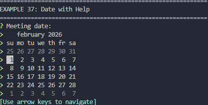
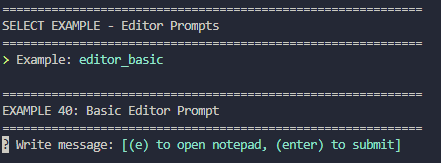

# 🐍🌈 pinq - Complete Python Binding for Inquire

[](https://www.python.org/downloads/)
[](LICENSE)
<div style="display: flex; gap: 10px; flex-wrap: wrap;">
  
  
</div>
<br>

**pinq** is a production-grade, 100% complete Python binding for the **Rust** [ inquire](https://github.com/mikaelmello/inquire) CLI prompt library. It provides an idiomatic Python interface to create beautiful, interactive command-line prompts across all platforms.

## Features

- ✨ **Complete API Coverage** - Every public type, function, and configuration from inquire is exposed in Python

- 🎨 **Interactive Prompts** - Text input, selections, multi-select, confirmations, passwords, dates, and more

- ⚡ **Cross-Platform** - Works perfectly on Linux, macOS, and Windows (including WSL)

- 🔧 **Fully Configurable** - Defaults, help messages, page sizes, custom formatting

- 🛡️ **Type Safe** - Full Python type hints for IDE support and type checking

- 🚀 **Production Ready** - Built with PyO3, compiled to native code via Maturin

- 🎯 **Idiomatic Python** - Builder pattern, Python enums, exception-based error handling

## Installation

```bash
pip install pinq
```

## Quick Start

### Simple Text Prompt

```python
import pinq

name = pinq.prompt_text("What is your name? ")
print(f"Hello, {name}!")
```

### Confirmation

```python
import pinq

if pinq.prompt_confirmation("Continue? "):
    print("Continuing...")
else:
    print("Canceled.")
```

### Selection

```python
import pinq

languages = ["Python", "Rust", "Go", "JavaScript"]
choice = pinq.SelectPrompt("Pick a language:", languages).prompt()
print(f"You chose: {choice}")
```

### Multi-Select

```python
import pinq

options = ["Apples", "Bananas", "Carrots", "Dates"]
selected = pinq.MultiSelectPrompt("Select fruits:", options).prompt()
print(f"Selected: {', '.join(selected)}")
```

### Numbers

```python
import pinq

age = pinq.prompt_int("Your age: ")
price = pinq.prompt_float("Price: $")
```

### Passwords

```python
import pinq

password = pinq.PasswordPrompt("Enter password: ").prompt()
```

### Dates

```python
import pinq

date = pinq.prompt_date("Select a date: ")
print(f"Selected: {date}")  # YYYY-MM-DD format
```

### Multi-Line Editor

```python
import pinq

text = pinq.EditorPrompt("Write a message: ").prompt()
```

## Builder Pattern

All prompts support method chaining for advanced configuration:

```python
import pinq

username = (pinq.TextPrompt("Username: ")
    .with_default("admin")
    .with_help_message("System administrator")
    .prompt())
```

### Configuration Options

**Text Prompts:**
- `.with_default(value)` - Default value
- `.with_help_message(text)` - Help text
- `.with_page_size(n)` - Pagination size

**Select/MultiSelect:**
- `.with_default(index)` / `.with_defaults(indices)` - Default selections
- `.with_help_message(text)` - Help text
- `.with_page_size(n)` - Items per page

**All Prompts:**
- `.with_help_message(text)` - Display help below prompt
- `.prompt_skippable()` - Allow ESC to skip (returns `None`)

## Prompt Types

| Class | Purpose | Example |
|-------|---------|---------|
| `TextPrompt` | Free text input | Username, email |
| `ConfirmPrompt` | Yes/no question | Delete confirmation |
| `PasswordPrompt` | Hidden text input | Password |
| `SelectPrompt` | Choose one from list | Pick an option |
| `MultiSelectPrompt` | Choose multiple from list | Select features |
| `IntPrompt` | Integer input | Count, port number |
| `FloatPrompt` | Float input | Price, percentage |
| `DateSelectPrompt` | Interactive calendar | Meeting date |
| `EditorPrompt` | Multi-line editor | Long form text |

## One-Liners

For quick prompts without configuration:

```python
import pinq

name = pinq.prompt_text("Name: ")
confirm = pinq.prompt_confirmation("Continue? ")
age = pinq.prompt_int("Age: ")
price = pinq.prompt_float("Price: ")
password = pinq.prompt_secret("Password: ")
date = pinq.prompt_date("Date: ")
```

## Error Handling

All prompts can raise `RuntimeError` for:
- **NotTTY** - Not running in a terminal
- **IOError** - Terminal communication error
- **OperationCanceled** - User pressed Ctrl+C or ESC
- **InvalidConfiguration** - Invalid prompt setup
- **Parse errors** - Invalid input for typed prompts

```python
import pinq

try:
    age = pinq.prompt_int("Age: ")
except RuntimeError as e:
    print(f"Error: {e}")
```

## Optional/Skippable Prompts

Use `.prompt_skippable()` to allow users to skip with ESC:

```python
import pinq

optional_comment = (pinq.TextPrompt("Comment (optional): ")
    .prompt_skippable())

if optional_comment is None:
    print("Skipped")
else:
    print(f"Comment: {optional_comment}")
```

## Comprehensive Documentation

Full documentation available in the `docs/` directory:

- **[overview.md](docs/overview.md)** - Architecture and design
- **[classes.md](docs/classes.md)** - All prompt classes and methods
- **[functions.md](docs/functions.md)** - One-liner convenience functions
- **[builders.md](docs/builders.md)** - Builder pattern guide
- **[enums.md](docs/enums.md)** - Enum types
- **[errors.md](docs/errors.md)** - Error handling reference
- **[examples.md](docs/examples.md)** - Real-world usage examples

## Examples

### User Registration

```python
import pinq

username = pinq.prompt_text("Username: ")
password = pinq.PasswordPrompt("Password: ").prompt()
country = pinq.SelectPrompt("Country:", 
    ["USA", "Canada", "UK"]).prompt()
newsletter = pinq.prompt_confirmation("Subscribe? ")

print(f"Registered: {username} from {country}")
```

### Configuration Wizard

```python
import pinq

port = (pinq.IntPrompt("Port: ")
    .with_default(3000)
    .prompt())

features = (pinq.MultiSelectPrompt("Enable:",
    ["Auth", "Cache", "Logging"])
    .with_defaults([0, 2])
    .prompt())

env = pinq.SelectPrompt("Environment:",
    ["dev", "staging", "prod"]).prompt()

print(f"Config: port={port}, features={features}, env={env}")
```

### Survey

```python
import pinq

name = pinq.prompt_text("Name: ")
rating = pinq.SelectPrompt("Rating:",
    ["Poor", "Fair", "Good", "Great"]).prompt()
feedback = pinq.EditorPrompt("Feedback:").prompt_skippable()

print(f"Survey from {name}: {rating}")
if feedback:
    print(f"Feedback: {feedback}")
```

## Platform Support

- ✅ Linux
- ✅ macOS
- ✅ Windows
- ✅ WSL (Windows Subsystem for Linux)

Uses the default `crossterm` backend which works reliably everywhere.

## API Reference

All types and functions are documented with full docstrings accessible via Python's `help()`:

```python
import pinq
help(pinq.SelectPrompt)
help(pinq.prompt_int)
```

## Performance

- **Compiled to native code** - PyO3 + Maturin for maximum speed
- **Minimal overhead** - Direct FFI to Rust implementation
- **No Python GIL** - Concurrent use possible

## Version Information

- **pinq**: 0.1.0
- **inquire**: 0.7
- **Python**: 3.8+

## License

MIT License - Same as inquire

## Contributing

This is a complete, production-ready binding. For bugs or feature requests related to the core prompt functionality, please refer to the [inquire repository](https://github.com/mikaelmello/inquire).

## Related Projects

- **[inquire](https://github.com/mikaelmello/inquire)** - The original Rust library
- **[PyO3](https://pyo3.rs/)** - Python bindings for Rust
- **[Maturin](https://github.com/PyO3/maturin)** - Python package build tool

## Troubleshooting

### "Input is not a TTY" Error

This occurs when running in a non-interactive environment:

```python
import sys
if not sys.stdin.isatty():
    print("Cannot use interactive prompts in non-TTY mode")
```

### Ctrl+C Behavior

Pressing Ctrl+C raises `RuntimeError` with message "Operation canceled by user":

```python
try:
    result = pinq.prompt_text("Input: ")
except RuntimeError as e:
    if "canceled" in str(e):
        print("User interrupted")
```

### Testing with Mocks

Mock pinq functions in unit tests:

```python
from unittest.mock import patch

@patch('pinq.prompt_text')
def test_my_function(mock_prompt):
    mock_prompt.return_value = "test value"
    # ... test code ...
```

## Support

- 📖 [Official Documentation](docs/overview.md)
- 🐛 [Issue Tracker](https://github.com/mikaelmello/inquire/issues)
- 💬 [Discussions](https://github.com/mikaelmello/inquire/discussions)

## Acknowledgments

Built with:
- [inquire](https://github.com/mikaelmello/inquire) - The original Rust library
- [PyO3](https://pyo3.rs/) - Python-Rust interop
- [Maturin](https://github.com/PyO3/maturin) - Build system

---

**Start building interactive CLI applications with Python today!** 🚀
